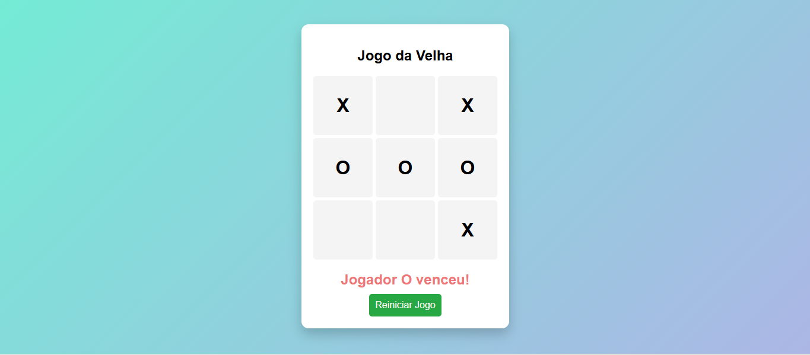

# 🎮 Jogo da Velha

Projeto simples e interativo de **Jogo da Velha (Tic-Tac-Toe)** desenvolvido com **HTML, CSS e JavaScript**, com foco em lógica de programação e manipulação do DOM.

---

## 🚀 Demonstração

🔗 Acesse o projeto:
👉 https://andersonabbade.github.io/jogo-da-velha/

---

## 📸 Preview



---

## 🧠 Funcionalidades

* ✅ Alternância entre jogador **X** e **O**
* ✅ Verificação automática de vitória
* ✅ Identificação de empate
* ✅ Interface simples e intuitiva
* ✅ Reinício do jogo

---

## 🛠️ Tecnologias utilizadas

* HTML5
* CSS3
* JavaScript (Vanilla)

---

## 📂 Estrutura do projeto

```
jogo-da-velha/
│
├── index.html
├── style.css
└── script.js
```

---

## 🎯 Objetivo do projeto

Este projeto foi desenvolvido com o objetivo de:

* Praticar **lógica de programação**
* Trabalhar com **eventos no JavaScript**
* Manipular elementos com **DOM**
* Construir um projeto completo do zero

---

## 📌 Aprendizados

Durante o desenvolvimento, foram aplicados conceitos como:

* Uso de `addEventListener`
* Controle de estado do jogo
* Condicionais para verificar vitória
* Manipulação de classes com `classList`

---

## 📈 Melhorias futuras

* [ ] Adicionar modo contra IA 🤖
* [ ] Placar de pontuação
* [ ] Animações ao vencer
* [ ] Responsividade para mobile

---

## 👨‍💻 Autor

Desenvolvido por **Anderson Abbade**

🔗 GitHub: https://github.com/andersonabbade
🔗 LinkedIn: https://www.linkedin.com/in/anderson-luis-1807m/

---

## ⭐ Se gostou do projeto

Deixe uma ⭐ no repositório para apoiar!
